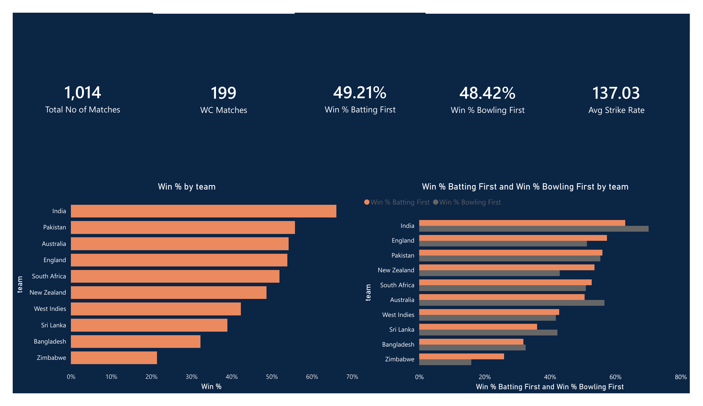
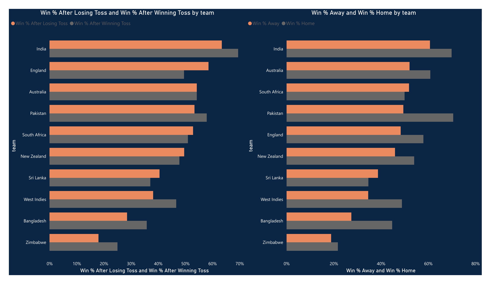
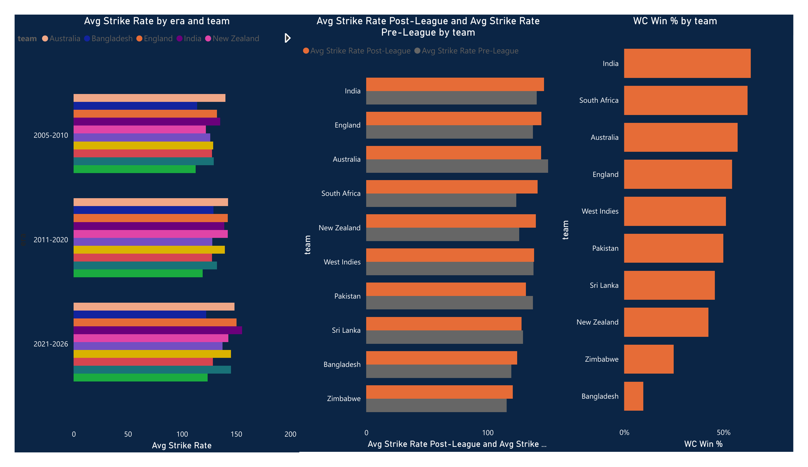
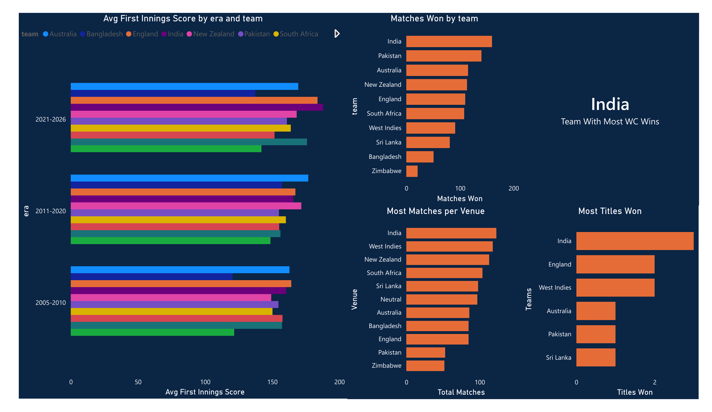

# T20I Cricket Analytics
Interactive Power BI dashboard and web visualization analyzing 1,014 men's T20 international matches across 10 nations (2005–2026).

## Dashboard Preview

### Overview

### Toss & Venue Analysis

### Era Trends

### World Cup Analysis

## What's in this repo
- **T20 Dashboard.pbix** — Full Power BI report, 4 pages: team overview, toss/venue impact, era trends, World Cup history
- **T20I_10_Teams_Dataset.xlsx** — Cleaned dataset (match-level and team-match-level tables) built from raw Cricsheet data
- **t20i-dashboard.html** — Standalone interactive web version, click any team to filter every chart (no software needed, just open in a browser)

## Data source
[Cricsheet.org](https://cricsheet.org) ball-by-ball archive, men's T20 internationals. Filtered to 10 nations: England, Pakistan, Australia, Sri Lanka, India, South Africa, West Indies, New Zealand, Bangladesh, Zimbabwe.

**Note:** Afghanistan is excluded — Cricsheet withholds all Afghanistan-involved matches as a site-wide policy, unrelated to this project.

## Methodology
- **Defending** = win % when batting first
- **Chasing** = win % when bowling first
- **League era cutoff** = 2008 (IPL launch), used to compare pre/post strike rates
- **Era buckets** = 2005–2010 / 2011–2020 / 2021–2026
- **World Cup matches** include all historical event naming conventions Cricsheet has used ("ICC Men's T20 World Cup," "ICC World Twenty20," "World T20")

## Key findings
- 1,014 total matches, 199 of them World Cup matches
- India leads both overall win % (66.1%) and World Cup win % (63.8%)
- Average strike rate rose from ~123 (2005–2010) to ~137+ (2021–2026), reflecting the T20 league era's impact on scoring
- India, England, and West Indies account for 7 of the 10 World Cup titles awarded since 2007

## Built with
Python (data processing), Power BI (DAX measures, report), Chart.js (interactive web version)

---
Built by [Rohan Mukhtar](https://www.linkedin.com/in/rohanmukhtar/)
